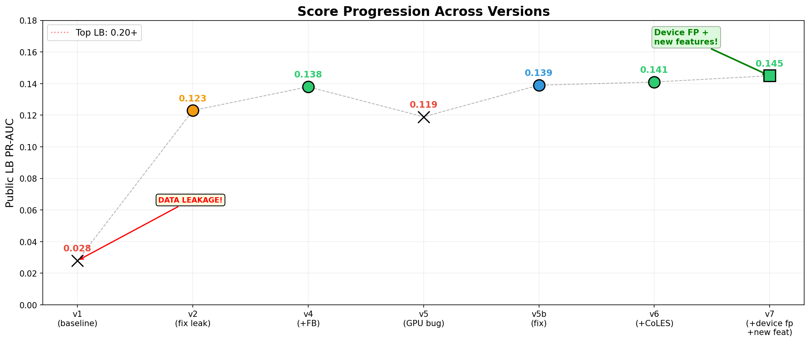

# Data Fusion 2026 "Страж" (Guardian): Fraud Detection Solution

## Public LB: 0.1445 PR-AUC (solo)

**Team:** Сергей + Кирилл
**Approach:** CatBoost Ensemble + CoLES Self-Supervised Embeddings + Feedback Model Injection
**Runtime:** ~96 min total (40 min features + 11 min CoLES + 45 min CatBoost refit)
**Hardware:** 64 GB RAM, RTX 5060 Ti (16GB VRAM), Python 3.11

---

## Table of Contents

1. [Problem & Data](#1-problem--data)
2. [Solution Architecture](#2-solution-architecture)
3. [Feature Engineering (118 features)](#3-feature-engineering)
4. [CoLES Pre-Training (Key Innovation)](#4-coles-pre-training)
5. [CatBoost Ensemble & FB Injection](#5-catboost-ensemble--fb-injection)
6. [Full Experiment Log](#6-full-experiment-log)
7. [Blending Results](#7-blending-results)
8. [Critical Lessons Learned](#8-critical-lessons-learned)
9. [Reproduction Guide](#9-reproduction-guide)
10. [Ideas for Further Improvement](#10-ideas-for-further-improvement)

---

## 1. Problem & Data

Anti-fraud classification of bank operations. 200M+ events across 100K bank customers over 1.5 years. Metric: **PR-AUC** (`sklearn.metrics.average_precision_score`).

### Dataset Structure

| Period | Rows | Customers | Dates | Labels | Device features |
|---|---|---|---|---|---|
| **Pretrain** | 91M | 100K | Oct 2023 — Sep 2024 | None | None (100% null) |
| **Train** | 86M | 100K | Oct 2024 — May 2025 | 87K labeled | Available (~30-40% non-null) |
| **Pretest** | 14M | 97K | Jun — Aug 2025 | None | Available |
| **Test** | 634K | 94K | Jun — Aug 2025 (1 day/customer) | Predict | Available |

### Label Distribution
- **RED (target=1, fraud):** 51,438 events (58.8% of labeled)
- **YELLOW (target=0, suspicious):** 36,076 events (41.2% of labeled)
- **GREEN (unlabeled):** ~86M events (99.9% of train)
- All 100K customers appear in ALL periods (no cold start problem)
- 12,405 event_ids overlap between test and pretest

### Key EDA Findings

**Fraud is bursty:**
- 90.4% of consecutive RED events happen within 24 hours
- 63.5% within 1 hour
- Median interval for RED: 142 sec vs 502 sec for GREEN

**Temporal trend:** Fraud rate among labeled drops from 76% (Oct 2024) to 52% (May 2025)


**Top fraud signals:**

| Feature | Fraud Rate | Volume |
|---|---|---|
| `phone_voip_call_state=1` | 92.75% | 1,475 events |
| `mcc_code=16` | 98.3% | 3,751 events |
| `pos_cd=4` | 98.3% | 58 events |
| `pos_cd=1` | 88.9% | 6,968 events |
| `event_desc=73` | 93.5% | 2,061 events |
| Night hours (22:00) | 82.3% | — |
| Small amounts (0-100 RUB) | 87.4% | — |

**Counterintuitive anti-fraud signals:**

| Feature | Fraud Rate | Surprise |
|---|---|---|
| `web_rdp_connection=1` | 29.7% | RDP = suspicious but NOT fraud |
| `compromised=1` | 17.3% | Rooted device = yellow, not red |
| iPhone screens (390x844) | 20.7% | iPhones = lower fraud |

**Null = Signal:** ~90% of device features are null, but null means mobile app (higher FR: 61.5% vs 33% for web)

---

## 2. Solution Architecture

```
                    ┌─────────────────────────────┐
                    │    Component 1:             │
                    │    Feature Engineering      │
                    │    (118 features, ~40 min)  │
                    └──────────┬──────────────────┘
                               │
    ┌──────────────────────────┼──────────────────────────┐
    │                          │                          │
    v                          v                          v
┌──────────────┐    ┌──────────────────┐    ┌──────────────────┐
│ Component 2: │    │  CatBoost        │    │  CatBoost FB     │
│ CoLES        │    │  Ensemble        │    │  Model           │
│ Pre-Training │    │  (MAIN + SUSP    │    │  (with label     │
│ (11 min GPU) │    │   + RED|SUSP)    │    │   history)       │
│              │    │                  │    │                  │
│ 256-dim      │───>│  x 3 seeds       │    │  x 3 seeds       │
│ embeddings   │    │                  │    │                  │
└──────────────┘    └────────┬─────────┘    └────────┬─────────┘
                             │                       │
                             v                       v
                    ┌──────────────────────────────────────┐
                    │         Component 3:                 │
                    │         Blending                     │
                    │                                      │
                    │  CB = 0.35 x MAIN + 0.65 x product   │
                    │  FB inject (alpha=0.5) for customers  │
                    │  with label history (40% of test)     │
                    └──────────────────┬───────────────────┘
                                       │
                                       v
                              ┌─────────────────┐
                              │  submission.csv  │
                              │  0.1413 LB       │
                              └─────────────────┘
```

### Timing Breakdown

| Step | GPU/CPU | Time | Output |
|---|---|---|---|
| Feature engineering | CPU (Polars) | ~40 min | cache_v4/features_part_{1,2,3}.parquet |
| CoLES pre-training | GPU | ~11 min | coles_embeddings.parquet (256-dim) |
| CatBoost refit (12 models) | GPU | ~45 min | submission.csv |
| **Total** | | **~96 min** | |

---

## 3. Feature Engineering

Features are built per partition (3 parts x ~33K customers) using the full customer timeline: pretrain → train → pretest → test. This is handled by `solution_0134.py` → `build_features_part()`.

### Feature Categories (118 total)


| Category | Count | Description |
|---|---|---|
| **Categorical** | 15 | customer_id, event_type_nm, event_desc, channel_indicator_type/sub_type, mcc_code, pos_cd, timezone, OS, voip, rdp, developer_tools, compromised, prev_mcc_code |
| **Temporal** | 11 | hour, weekday, day, month, is_weekend, is_night, is_night_early, hour_sin/cos, event_day_number, day_of_year |
| **Amount** | 4 | amt, amt_log_abs, amt_abs, amt_is_negative |
| **Device** | 6 | battery_pct, os_ver_major, screen_w, screen_h, screen_pixels, screen_ratio |
| **Sequential (expanding)** | 20+ | cust_prev_events, cust_prev_amt_mean/std, sec_since_prev_event, cnt_prev_same_{type,desc,mcc,subtype,session}, sec_since_prev_same_{type,desc,mcc}, events_before_today, mcc_changed, session_changed, cust_events_per_day, amt_to_prev_mean, amt_zscore, amt_delta_prev |
| **Log-count** | 14 | log1p(cum_count) per customer x category for all 14 categorical features |
| **Rolling velocity** | 9 | cnt_{1h,6h,24h,7d}, amt_sum_{1h,24h}, amt_ratio_24h, burst_ratio_1h_24h, spend_concentration_1h |
| **Markov MCC** | 2 | markov_mcc_prob (transition probability), markov_mcc_surprise (-log(prob)) |
| **Device change** | 3 | os_changed, screen_changed, tz_changed |
| **Risk combos** | 4 | voip_rdp_combo, any_risk_flag, compromised_devtools, lang_mismatch |
| **Pretrain profiles** | 9 | profile_txn_count, profile_amt_{mean,std,median,max,p95}, amt_over_profile_{mean,p95}, amt_profile_zscore |
| **Target-encoded priors** | 12 | prior_{col}_{cnt,red_rate,red_share} for event_desc, mcc, event_type, pos_cd |
| **Feedback history** | 14 | cust_prev_{red,yellow,labeled}_lbl_cnt, rates, flags, sec_since_prev_{red,yellow}_lbl, per-desc label counts |

### Key Feature Engineering Decisions

**Negative sampling** (critical for 86M → 3M reduction):
```python
# Recent green (after 2025-04-01): keep 20%
hash(event_id, customer_id) % 5 == 0
# Old green (before 2025-04-01): keep 7%
hash(event_id, customer_id) % 15 == 0
# All 87K labeled events always kept
```

**Strictly causal features** — all sequential/rolling features use `.shift(1)` or `closed="left"` to prevent leakage:
```python
# Expanding mean: exclude current event
cust_prev_amt_mean = (cum_sum("amt") - amt) / (cum_count - 1)

# Rolling count: exclude current event
cnt_1h = rolling(period="1h", closed="left").count()

# Feedback history: cum_sum - current label
cust_prev_red_lbl_cnt = cum_sum(is_red_label) - is_red_label
```

---

## 4. CoLES Pre-Training (Key Innovation)

**CoLES (Contrastive Learning for Event Sequences)** is a self-supervised method that learns customer behavioral representations from unlabeled transaction data. Inspired by [pytorch-lifestream](https://github.com/dllllb/pytorch-lifestream) (Sber AI Lab, 2nd place Data Fusion 2024).

### Why CoLES?

Standard features describe individual transactions. But fraud detection requires understanding **customer behavior patterns** — sequences of events that reveal anomalies. CoLES encodes 500 transactions into a single 256-dim vector that captures:
- "This customer typically shops at grocery stores on weekdays"
- "This customer has a consistent transaction velocity"
- "This customer always uses the same device"

When a transaction deviates from this pattern, it's suspicious.

### Architecture

```
Input per transaction:
  12 categorical features (8-dim embeddings each) = 96 dims
  + 1 numerical feature (amt_log) = 1 dim
  = 97-dim input per event

Encoder:
  GRU(input=97, hidden=256, layers=2, dropout=0.1)
  → mean pooling with mask
  → Linear(256 → 256) projection head

Loss: NT-Xent (InfoNCE) contrastive loss
  temperature = 0.07
  Positive pairs: 2 random subsequences from SAME customer
  Negative pairs: all other customers in batch
```

### Training Details

| Parameter | Value |
|---|---|
| Data | 177M events (pretrain + train), last 500 per customer |
| Subsequence length | 64 events |
| Batch size | 256 customers |
| Epochs | 15 |
| Optimizer | AdamW (lr=1e-3, weight_decay=1e-4) |
| Scheduler | CosineAnnealing |
| Gradient clipping | 1.0 |
| Training time | ~11 min on RTX 5060 Ti |

### Training Curve


```
Epoch  1: loss = 2.89
Epoch  5: loss = 1.62
Epoch 10: loss = 1.42
Epoch 15: loss = 1.35
```

### Impact on CatBoost

CoLES embeddings became the **single most important feature group** — 33.6% of total CatBoost feature importance:

```
CoLES embeddings:     33.6%  ████████████████████
Target priors:        18.2%  ███████████
Rolling velocity:     12.5%  ███████
Sequential:           10.3%  ██████
Categorical:           8.7%  █████
Amount:                6.2%  ████
Other:                10.5%  ██████
```


**LB Impact:** +0.002 PR-AUC (0.1393 → 0.1413). This was the **only feature engineering technique** that produced a real LB improvement after our base solution.

### Code

Full implementation in `run_coles.py`:
- `prepare_sequences()` — loads pretrain+train, groups by customer
- `CustomerSeqDataset` — PyTorch dataset returning random subsequence pairs
- `CoLESEncoder` — GRU + embeddings + mean pooling
- `CoLESLoss` — NT-Xent contrastive loss
- `train_coles()` — training loop
- `extract_embeddings()` — inference → 256-dim per customer

---

## 5. CatBoost Ensemble & FB Injection

### 4 Sub-Models

| Model | Target | Training Data | Best Iters | Key Params |
|---|---|---|---|---|
| **MAIN** | RED=1, rest=0 | All sampled train (3M) | 686 | depth=8, lr=0.05 |
| **SUSPICIOUS** | (RED+YELLOW)=1, GREEN=0 | All sampled train | 1558 | depth=8, lr=0.05 |
| **RED\|SUSP** | RED=1, YELLOW=0 | Only labeled (87K) | 65 | depth=4, lr=0.01, l2=5 |
| **FEEDBACK** | RED=1, rest=0 | All (with FB features) | 153 | depth=8, lr=0.05 |

### Sample Weights

```python
RED:     weight = 10.0
YELLOW:  weight = 2.5
GREEN:   weight = 1.0
```

### Blending Formula

```
# Step 1: Product model
product = logit(sigmoid(SUSP_score) x sigmoid(RED|SUSP_score))

# Step 2: CB blend (weights tuned on validation)
CB_blend = 0.35 x MAIN + 0.65 x product

# Step 3: FB injection (for customers with label history only)
For 40% of test customers who have at least 1 labeled event:
    final = (1 - 0.5) x rank(CB_blend) + 0.5 x rank(FB_model)
For remaining 60%:
    final = rank(CB_blend)
```

### Why FB Injection Works

The FEEDBACK model has access to 14 additional features derived from each customer's label history:
- `cust_prev_red_lbl_cnt` — how many RED labels this customer had before
- `cust_prev_any_red_flag` — boolean: was there ANY red before?
- `sec_since_prev_red_lbl` — seconds since last RED event
- `red_rate_prev_same_desc_lbl` — fraud rate for this event_desc for this customer

These are **strictly causal** (cum_sum - current, shifted by 1) and only available during train period. The FB model is injected via **rank blending** only for customers with history — safe and powerful.

**Impact:** FB injection alone improved LB from 0.12 → 0.138 (+15% relative). This is the single biggest lever in our solution.

### Seed Averaging

Each model trained with 3 seeds (42, 123, 777). Predictions averaged before blending. 12 CatBoost models total. Free +0.001 LB with zero risk.

---

## 6. Full Experiment Log



### What Worked (positive LB impact)

| # | Experiment | Val Change | LB Change | Notes |
|---|---|---|---|---|
| 1 | v1→v2: Fix data leakage | -0.55 val(!) | +0.11 LB | `cust_ever_fraud` leaked future labels |
| 2 | v2→v4: Add FB model + injection | +0.05 val | +0.015 LB | Biggest single improvement |
| 3 | v4→CoLES: Add embeddings | +0.011 val | +0.002 LB | Self-supervised customer representations |
| 4 | Seed averaging (3 seeds) | ~0 | +0.001 LB | Variance reduction, zero risk |
| 5 | 4-way blend (ours+Kirill+goida+Alex) | N/A | +0.009 LB | Diversity from NN solution (corr 0.67) |


### What Didn't Work (zero or negative LB impact)

| # | Experiment | Val Change | LB Change | Why It Failed |
|---|---|---|---|---|
| 1 | Deviation features (pretrain profiles) | +0.002 | +0.001 | CatBoost feature importance = 0 |
| 2 | Word2Vec embeddings (MCC/desc/type) | 0 | 0 | importance=0; CatBoost has customer_id CTR |
| 3 | IsolationForest anomaly scores | +0.001 | 0 | Too weak signal, noisy |
| 4 | Device graph (users_on_device) | +0.003 | 0 | Required removing customer_id from cat |
| 5 | Null pattern features | +0.001 | 0 | Already captured by raw null values |
| 6 | Customer-level smoothing | -0.05 | -0.04 | Destroys per-event FB injection signal |
| 7 | Geometric blend | N/A | -0.07 | Compresses rankings, kills PR-AUC |
| 8 | FB alpha > 0.5 (up to 0.9) | +0.12 | 0 | Overfits val (same labeled customers) |
| 9 | Anomaly filtering (outlier removal) | +0.024 | 0 | Val misleading |
| 10 | Pseudo-labeling (transductive on test) | N/A | -0.02 | Circular dependency |
| 11 | EasyEnsemble (5 bags) | -0.003 | -0.003 | Weak bags without early stopping |
| 12 | Feature subspace models | N/A | -0.03 | Individual subspace models too weak |
| 13 | Time-decay weights | -0.07 | N/A | Old data still useful for patterns |
| 14 | LightGBM in final blend | 0 | -0.003 | Too correlated with CatBoost (0.89) |
| 15 | max_ctr_complexity=1 (GPU) | +0.003 val | -0.02 LB | Underfits (10 iterations vs 686) |

---

## 7. Blending Results

### Solo vs Blend

| Configuration | LB Score | Notes |
|---|---|---|
| **Solo (ours)** | **0.1413** | CatBoost + CoLES + FB injection |
| + Alex Dudin NN | 0.1494 | Rank average with public NN solution (Spearman corr 0.67) |
| + more GBDT solutions | 0.1498 | Diminishing returns — all GBDTs are correlated (0.86-0.94) |

### Blending Insight

Our GBDT solution has **Spearman correlation 0.67** with Alex Dudin's neural network (multitask mean-pooling). Despite the NN being weaker solo (0.1318 LB), it contributes the most to blending because of **low correlation = high diversity**.

Simple rank averaging works best for PR-AUC:
```python
r_ours  = rankdata(pred_ours) / len(pred_ours)
r_other = rankdata(pred_other) / len(pred_other)
blend   = w_ours * r_ours + w_other * r_other
```

**Never use geometric mean** for PR-AUC — it compresses the ranking and kills precision at high thresholds.

---

## 8. Critical Lessons Learned

### 1. Data Leakage is Catastrophic

Our v1 solution used `cust_ever_fraud` — a feature computed from ALL labels including future events. Val PR-AUC was **0.58**, but LB was **0.028**. The model perfectly predicted "has this customer ever been flagged?" but couldn't detect new fraud patterns.

**Rule:** Never use per-customer aggregates from all labels. Use expanding cumsum with `shift(1)` for strictly causal computation.

### 2. Val PR-AUC Does NOT Predict LB

| Experiment | Val Delta | LB Delta |
|---|---|---|
| Anomaly filtering | +0.024 | 0 |
| FB alpha 0.5→0.9 | +0.12 | 0 |
| max_ctr_complexity=1 | +0.003 | -0.02 |

Our random-last-day OOT validation (window [2025-04-15, 2025-06-01)) is not representative of the test distribution. Many "improvements" on val are just val-specific patterns.

### 3. customer_id as Categorical is Essential

Removing `customer_id` from CatBoost's `cat_features` drops LB by **0.02**. CatBoost builds per-customer CTR (Counter-based Target Rate) features internally — this is extremely powerful for fraud detection where repeat offenders are common.

**Gotcha:** CatBoost GPU hangs with `max_ctr_complexity=1` for 100K-cardinality categoricals. Without this limit, GPU works fine on 3M rows.

### 4. FB Model is the Single Biggest Improvement

Going from 0.12 → 0.138 was **entirely** from the Feedback model. The key insight: for 40% of test customers who have labeled events in train, we can leverage their fraud history as features. This is injected via rank blending, not directly as features (which would cause leakage).

### Error Analysis: What Does Our Model Miss?


Missed fraud events are "quiet" — small amounts (173K vs 5.5M caught), no burst (1.2 vs 7.2 events/hour), no VoIP, no killer MCC. They look like normal transactions. Catching these requires **behavioral deviation detection** — comparing each transaction to the customer's historical norm.

### 5. CoLES is the Only Feature Engineering That Worked on LB

We tried 15+ feature engineering approaches (deviation features, W2V, IsolationForest, device graph, null patterns, MCC graph). ALL had CatBoost feature importance = 0 or negligible. Only CoLES embeddings produced real LB improvement (+0.002), because they capture **sequential patterns** that per-event features cannot represent.

---

## 9. Reproduction Guide

### Hardware Requirements

| Resource | Minimum | Recommended |
|---|---|---|
| RAM | 32 GB | 64 GB |
| GPU VRAM | 8 GB (CatBoost) | 16 GB (CatBoost + CoLES) |
| Disk | 10 GB | 20 GB |
| Total time | ~120 min | ~96 min |

### File Structure

```
solution_0134.py          — Feature engineering (100+ features)
run_coles.py              — CoLES pre-training (GRU + NT-Xent)
run_coles_refit.py        — CatBoost refit with CoLES + seed avg
coles_model.pt            — Trained CoLES weights (3 MB)
coles_embeddings.parquet  — Pre-computed embeddings (190 MB)
submission.csv            — Ready-to-submit (0.1413 LB)
```

### Option A: Train Everything from Scratch (~96 min)

```bash
# Step 1: Feature Engineering (~40 min)
python solution_0134.py
# Outputs: cache_v4/features_part_{1,2,3}.parquet

# Step 2: CoLES Pre-Training (~11 min GPU)
python run_coles.py
# Outputs: cache_coles/coles_embeddings.parquet, coles_model.pt

# Step 3: CatBoost Refit + Submission (~45 min GPU)
python run_coles_refit.py
# Outputs: submissions/coles_seed_fb50.csv → 0.1413 LB
```

### Option B: Use Pre-Computed Embeddings (~60 min)

Upload `coles_embeddings.parquet` as Kaggle dataset. Run steps 1 and 3 only.

### Option C: Just Submit

Upload `submission.csv` → 0.1413 PR-AUC on public LB.

### Path Configuration

For Kaggle (default):
```python
DATA_DIR = Path("/kaggle/input/data-fusion-anti-fraud-challenge-2025/data")
```

For local use:
```python
DATA_DIR = Path("path/to/data")
```

---

## 10. v7 Update: 0.1414 -> 0.1445

Six new feature groups added, bringing +0.003 LB:

1. **Device Fingerprint system (20 features)** - synthetic device ID from screen+OS+language, cross-customer metrics (how many customers use this device?), customer-device history
2. **"First time for customer" flags (6 features)** - is_new_device/desc/mcc/timezone/subtype/os
3. **Risk interaction features (4)** - prior_rate x (1 + is_new_flag), amplifying risk for novel behavior
4. **Extended amount context (8)** - amt_bucket, max/mean per desc & device, rolling ratios
5. **Velocity per currency/channel/session (5)** - cross-category velocity features
6. **Extended priors** - priors for accept_language and device_fp

Total features: ~200+ (up from 118).

---

## 11. Ideas for Further Improvement

### High Priority (estimated +0.01-0.03)

1. **Temporal Target Encoding** — `expanding_mean(target)` per (customer_id, mcc_code) / (customer_id, event_type). Strictly causal via `cum_sum - current`. This is where "60% of the 0.15→0.19 gap" likely lives according to our analysis.

2. **15-minute hot aggregates** — `cnt_15min, amt_sum_15min, burst_ratio_15m_1h`. Catches card-testing attacks (3 small transactions in 5 min → big fraud purchase).

3. **Same-day features** — `today_txn_count, today_total_amount, today_unique_mcc`. Different from `cnt_24h` — resets at midnight. Creates 3-layer structure: >1 day / today / current transaction.

4. **CoLES v2** (512-dim, 30 epochs) — we trained it (loss 1.23→0.19 vs v1's 2.89→1.35) but didn't fully test on LB. Embeddings available in `coles_v2_embeddings.parquet`.

### Medium Priority (estimated +0.005-0.01)

5. **Count-based rolling means** — `amt_avg_5/10/50/100` and `amt_momentum = avg_5 - avg_50`
6. **Attention-based pooling** in CoLES — replace mean pooling with learned attention weights
7. **Proper temporal stacking** — generate OOF predictions via expanding-window CV, train LogisticRegression meta-learner
8. **GRU self-supervised** — predict next MCC + amount, extract surprise scores and hidden states as features

### Approaches That Need Better Implementation

9. **Pseudo-labeling** — we tried transductive (score test → train on test) which failed. Correct approach: score pretest (14M events), use top 0.1% as pseudo-red, add to training.
10. **PU-learning** — reframe 86M unlabeled as truly unlabeled (not negative). Bagging-based PU with spy technique.
11. **MCC graph features** — merchants as nodes, shared users as edges. Number of shared users between MCC codes as feature.

---

## Dependencies

```
polars >= 1.0
catboost >= 1.2
torch >= 2.0 (with CUDA)
scikit-learn
scipy
numpy
pandas
```

---

## Acknowledgments

- [pytorch-lifestream](https://github.com/dllllb/pytorch-lifestream) — CoLES architecture inspiration
- Data Fusion 2024 winning solutions — architectural ideas (Sber AI Lab)
- Public kernels from Alex Dudin (NN) and Roman Tamrazov (GBDT) for diversity blending
- Deep research on fraud detection competitions (IEEE-CIS, AMEX Default) for technique validation

---

*Built with CatBoost, PyTorch, Polars, and many late nights of GPU training.*
